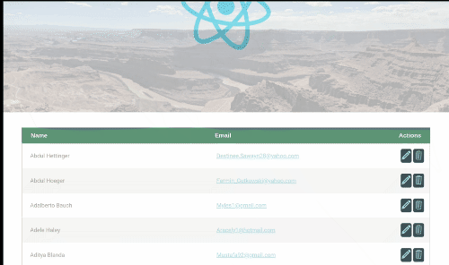

# MERN

A continually updated workbook to demonstrate competency with the Mongo, ExpressJs, React, Node technologies (M.E.R.N.). Guess you could throw Docker in there too . . . MERN'D!!

# Dependencies

* [Docker](https://docs.docker.com/install/)
* [Docker Compose](https://docs.docker.com/compose/install/)

# Installation

From the root of this (cloned) repo on your machine, simply run:

```bash
docker-compose up --build
```

That will:

* pull & build the Docker images required
* build & run the Docker containers from those images

If this is your first time running this you ought to seed the Mongo database. For that just use the "mern-server" container you just built to run the `seedDatabase.js` script:

```bash
docker exec mern-server node seedDatabase.js
```

Then, open your web browser to [localhost:3000](http://localhost:3000) to view the page!


